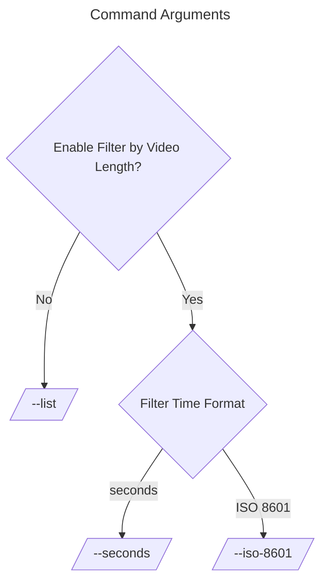

# YouTube Video Length Search

Searches YouTube video with specified duration by YouTube Data API

## Dependencies

- [google-api-python-client](https://pypi.org/project/google-api-python-client/): Install this package using `pip install google-api-python-client`.

## Usage

1. Obtain a YouTube API key: Replace `"YOUR_YOUTUBE_API_KEY"` in the script with your actual YouTube API key. If you don't have one, follow the instructions to create a new API key on the [Google Developer Console](https://console.developers.google.com/).

2. Command-line arguments:

   - `-i` or `--iso-8601`: Specify the target duration in ISO 8601 time format (e.g., PT14M7S).
   - `-s` or `--seconds`: Specify the target duration in seconds (e.g., 411).
   - `-l` or `--list`: Use this option for a list of videos without filtering by duration.
   - `-q` or `--search-query`: Provide your desired search query (e.g., "00:14:07").

   Note: You can use the `-t` or `--test` flag to test the program with example inputs.

3. Run the script: Execute the script with the desired command-line arguments. For example:
```
python youtube-video-length.py -i PT14M7S -q "00:14:07"
```

4. Output: The script will display YouTube video titles, IDs, ISO duration, and duration in seconds for videos that match the specified criteria.


## Example Application

An example application of this program is to solve the password game with rule 24, as described on [Neal.fun](https://neal.fun/password-game/).

## Example output
example-output.txt:
```txt
$ ./youtube-video-length-w-key.py -t
Video Title: جھوٹ پکڑا گیا9مئی کا غبارہ پھٹ گیا؟کرش خان پھر ناکام، یتیموں کی نئی پارٹی؟ڈیتھ سیل میں قیدیوں پر ظلم
Video ID: t-m5hWMq0mw
Video Duration (ISO): PT14M7S
Video Duration (s): 847 seconds

Video Title: 1 Billion Tonnes and counting, Canada Nickel Company Expands Land Package (TSX.V:CNC)
Video ID: a-EEvU8eIe8
Video Duration (ISO): PT14M7S
Video Duration (s): 847 seconds

Video Title: ن لیگ کافوج کیخلاف گندا کھیل 100راہنما فارغ کرنیکا منصوبہ؟ فوجی عدالتوں کا مقدمہ اہم ہوگیا
Video ID: IOeyBMewQSc
Video Duration (ISO): PT14M7S
Video Duration (s): 847 seconds

Video Title: لڑائی بڑھ گئی | چیف جسٹس بندیال، آرمی چیف آمنے سامنے | DGISPR کی دھمکیاں | چیف جسٹس ڈٹ گئے
Video ID: JiHBu5hh-qg
Video Duration (ISO): PT14M7S
Video Duration (s): 847 seconds

Video Title: چودہ جماعتیں87 وزیر لیکن پاکستان ہارگیا | آرمی چیف سےایک سوال؟کرش خان پراجیکٹ واشنگٹن میں بھی ناکام؟
Video ID: ovn3HpHuEDo
Video Duration (ISO): PT14M7S
Video Duration (s): 847 seconds
```

## Development
Use release.py to remove api key

## Disclaimer

Please note that this script uses the YouTube Data API, and you need to abide by the API usage policies set by YouTube. It's recommended to refer to the [YouTube API Terms of Service](https://developers.google.com/youtube/terms/api-services-terms-of-service) and ensure compliance with their requirements.

## License

This script is provided as-is and is subject to the terms of the [LICENSE](LICENSE) file. Use it responsibly and at your own risk.