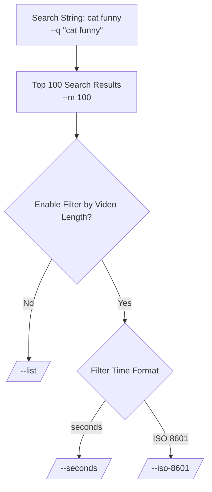

# YouTube Video Length Search

Searches YouTube video with specified duration by YouTube Data API

## Dependencies

- [google-api-python-client](https://pypi.org/project/google-api-python-client/): Install this package using `pip install google-api-python-client`.

## Usage

1. Obtain a YouTube API key: Replace `"YOUR_YOUTUBE_API_KEY"` in the script with your actual YouTube API key. If you don't have one, follow the instructions to create a new API key on the [Google Developer Console](https://console.developers.google.com/).

2. Command-line arguments:

   - `-i` or `--iso-8601`: Specify the target duration in ISO 8601 time format (e.g., PT14M7S).
   - `-s` or `--seconds`: Specify the target duration in seconds (e.g., 411).
   - `-l` or `--list`: Use this option for a list of videos without filtering by duration.
   - `-q` or `--search-query`: Provide your desired search query (e.g., "00:14:07").

   Note: You can use the `-t` or `--test` flag to test the program with example inputs.

3. Run the script: Execute the script with the desired command-line arguments. For example:
```
./youtube-video-length-w-key.py -q "cat funny" -i PT5S
```

4. Output: The script will display YouTube video titles, IDs, ISO duration, and duration in seconds for videos that match the specified criteria.


## Example Application

An example application of this program is to solve the password game with rule 24, as described on [Neal.fun](https://neal.fun/password-game/).

## Example output
```txt
$ ./youtube-video-length-w-key.py -q "cat funny" -i PT5S
Video Title: cute cat funny dance video 😹 || #funny #funnydance #ytshort #shortfeed #youtubeshorts  #shortviral
Video ID: gSI3nr5qwXs
Video Duration (ISO): PT5S
Video Duration (s): 5 seconds

Video Title: dancing cat🐱funny dance #shorts ytshorts #viralshorts
Video ID: dAKBqZrkuhc
Video Duration (ISO): PT5S
Video Duration (s): 5 seconds
```
```txt
$ ./youtube-video-length-w-key.py -q "cat funny" -l -m 5
Video Title: Funny Cat Fails | Funny Cat Compilation - FailArmy
Video ID: DHfRfU3XUEo
Video Duration (ISO): PT8M14S
Video Duration (s): 494 seconds

Video Title: Funniest Cats and Dogs 🐶🐱 | Funny Animal Videos #35
Video ID: tAcjl9S9exw
Video Duration (ISO): PT12M35S
Video Duration (s): 755 seconds

Video Title: 😹 FUNNIEST Cats Ever | Hilarious Cat Videos
Video ID: O4MV5BRv-ps
Video Duration (ISO): PT1H26S
Video Duration (s): 3626 seconds

Video Title: #75 Funny Cat videos 🐱🐱 #meowing #memes #cute
Video ID: ORTR9Jz-dCc
Video Duration (ISO): PT59S
Video Duration (s): 59 seconds

Video Title: UNEXPLAINABLE Behaviour of Orange Cats 🍊😹 Funny Cat Videos 2024
Video ID: Pcw8gDYEcGQ
Video Duration (ISO): PT9M8S
Video Duration (s): 548 seconds
```
## Development
Use release.py to remove api key

## Disclaimer

Please note that this script uses the YouTube Data API, and you need to abide by the API usage policies set by YouTube. It's recommended to refer to the [YouTube API Terms of Service](https://developers.google.com/youtube/terms/api-services-terms-of-service) and ensure compliance with their requirements.

## License

This script is provided as-is and is subject to the terms of the [LICENSE](LICENSE) file. Use it responsibly and at your own risk.